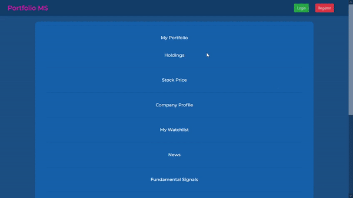
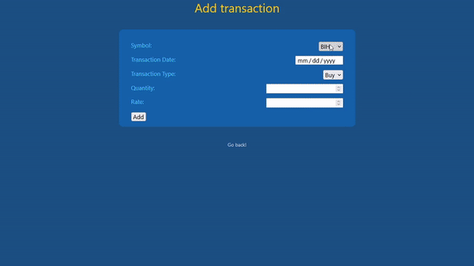

# MarketMinds 
A stock market portfolio management system developed as a Database Management System (DBMS), incorporating scrip recommendations through the analysis of both fundamental and technical indicators.
Technologies used currently: 
Flask, HTML, CSS, Bootstrap, JavaScript, MySQL

# Demo:

